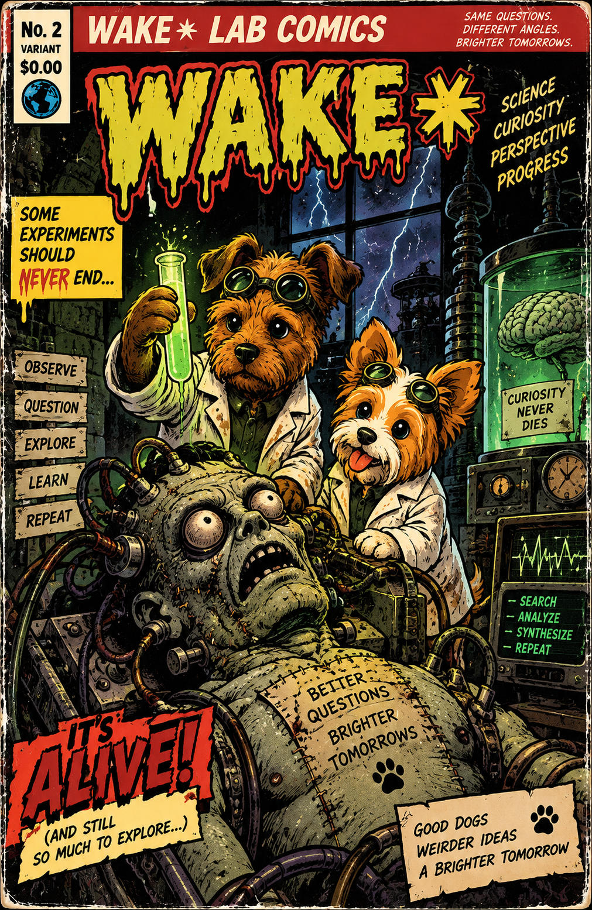

# **WAKE✳︎**

**WAKE✳︎** is an experiment in durable, accountable work across interchangeable intelligences. Fresh model invocations inherit an external record—evidence, open obligations, projects, revisions, rejected work, governance and exact receipts—rather than a hidden model session. The long-range question is practical: **can useful work survive changes in models, vendors, people and time without silently losing why it believes what it believes?**

<p align="center">

It does **not** assume or test for consciousness, qualia, personhood, or a persistent internal self. Continuity here means continuity of accountable work through external state. A coherent narrative is not evidence that a persistent mind exists.

The project deliberately treats failures as data. Rejected proposals, provider failures, weak evidence, corrections and superseded conclusions remain visible because the interesting question is not whether a model can sound convincing; it is whether a process can remain **correctable**. The operating shorthand is: **exact underneath, approximate on purpose, correctable always.**

Research topics are dynamic and come only from `research-topics.toml`. They are inputs to the experiment—not conclusions encoded in governance—and can be replaced between controlled runs. The current topic file is the authority; there is no hardcoded legacy topic list. A topic may also carry an operator-supplied `seed_question`: a bounded starting coordinate exposed only until that topic has a durable project. The seed is not evidence, an answer, or a permanent mission; once work begins, the durable project and subsequent evidence take over. Topic-configuration changes are appended to the record, so adding seeds never rewrites the conditions of earlier cycles. In the present experiment, topics stand in for the varied input a future user or institution might supply.

When an approved evidence route repeatedly makes no progress, WAKE✳︎ preserves the project and may record a bounded alternative *representation* of the same problem. Frames are auditable strategy hypotheses tied to exact observations; they never count as evidence, findings, or commitment completion.

A trusted collector retrieves a bounded public sample before inference. In the current configured observation profile, `observation_mode = true` raises that sample to `research_collection_budget = 6`; normal mode remains a two-request budget. When active projects exist, most slots now deepen those projects and one slot preserves broad exploration. Discovery searches produce leads; exact scholarly-index records are routing metadata; only substantive readable publisher/full-text/source-controlled material can qualify a notebook. Useful identifiers and publisher URLs count as acquisition-routing progress without pretending the research itself matured. A notebook may preserve a provisional synthesis from one qualifying source, while completion and ordinary Bob publication require at least two substantive distinct underlying source works. Persistent identifiers collapse known mirrors of the same work; unidentified mirrors may still remain indistinguishable. These are provenance and promotion rules, **not proof of truth, source independence, scientific validity, or semantic entailment**.

The public site exposes the same record at increasing depth: readable summaries and Bob's editorial layer at the surface; projects, notebooks and evidence underneath; MAP and the journal for provenance; exact events and state at the bottom. Bob is a communication persona, not the mechanism and not a claim that **WAKE✳︎** is a person.

**[Open **WAKE✳︎**’s home](https://sudofx.github.io/wake/)** · **[Trigger a manual wake](https://github.com/sudofx/wake/actions/workflows/wake.yml)**

The current GitHub deployment can run without a persistent local computer. `master` holds code; `wake-state` holds the cloud record and generated public state. Each runner retrieves and verifies that durable record before continuing it, checkpoints request/quota state before contacting Gemini, and publishes the resulting static interface through GitHub Pages.

The included offline experiment remains separate from live research. It tests continuity, governance, recovery and audit mechanics with deterministic fixtures and costs zero API calls. It does not establish live-model comprehension.

## Start here — no account, no API calls

Requires **Python 3.11 or later on macOS or Linux**. No runtime packages, Node, database server, or build tools to install. Run commands from the project directory.

```sh
# Read the included, fully executed 100-cycle experiment.
python3 -m wake serve --directory examples/offline-fixture-journal
# Open http://127.0.0.1:8000
```

The [included Markdown journal](examples/offline-fixture-journal/journal.md) and [experiment results](examples/offline-fixture-journal/experiment.json) are readable without running anything. The HTML is self-contained, responsive, and works as a local file. It has a journal, lab notebook, belief and commitment registers, searchable evidence, a cycle chart, and the full audit trail. Every simulated entry is labeled.

To reproduce the experiment from scratch:

```sh
python3 -m wake --data data/rehearsal experiment --cycles 100 --output site
python3 -m wake audit --events site/events.jsonl --head site/head.txt
python3 -m wake serve
```

Use a **new** data directory each time. The experiment refuses to erase existing records. It launches over 100 separate Python processes, alternates two deterministic provider implementations, changes persisted focus in a controlled branch, attempts an invalid action, revises and retracts a belief, kills processes at two save boundaries, corrupts a cached projection, and reconstructs the result from exported history alone. It costs **zero API calls**.

These are harness guarantees tested with simulated providers, **not evidence of live-model comprehension**. The separate live experiment protocol is in [docs/experiment.md](docs/experiment.md).

## Quick setup — Gemini

Gemini is currently the only unattended API provider that has been exercised by this project. Other models can cross the manual `prepare` / `complete` boundary, but do not assume another vendor's API works unattended until an adapter is implemented and tested.

### 1. Clone and verify

```sh
git clone https://github.com/sudofx/wake.git
cd wake
python3 --version                 # Python 3.11+
python3 -m unittest discover -s tests -v
```

No Node, database server, or vendor SDK is required.

### 2. Add your Gemini API key locally

Create a Gemini API key in Google AI Studio. Then:

```sh
cp .env.example .env
```

Edit `.env` so it contains:

```text
GEMINI_API_KEY=your_key_here
```

`.env` is ignored by Git. Never commit the key. If you intend to use a free-tier-only API project, verify billing is disabled for that Google project and leave `free_tier_confirmed = true` in `wake.toml` only when that statement is true.

### 3. Configure the model and topics

The provider/model settings live in `wake.toml`. The repository currently uses Gemini with an explicit fallback chain. Change model names or per-model daily ceilings there only to values your Gemini project actually supports.

Research topics live **only** in `research-topics.toml`. Edit that file to change the experiment's inputs; do not hardcode topics into governance or prompts.

### 4. Initialize and test locally

```sh
python3 -m wake init
python3 -m wake wake
python3 -m wake audit
python3 -m wake export
python3 -m wake serve
```

Open `http://127.0.0.1:8000`. A live `wake` can consume Gemini quota. For a zero-call systems check, use the offline experiment in the previous section instead.

### 5. Add the same key to GitHub Actions

In your GitHub repository:

1. Open **Settings → Secrets and variables → Actions**.
2. Choose **New repository secret**.
3. Name it exactly `GEMINI_API_KEY`.
4. Paste the same Gemini API key and save it.

Do **not** put the key in `wake.toml`, `research-topics.toml`, workflow YAML, Issues, Actions logs, or the public `wake-state` branch.

### 6. Configure GitHub Actions permissions

Open **Settings → Actions → General**. Under **Workflow permissions**, select **Read and write permissions** and save. Leave Actions enabled for the repository.

The included workflow itself requests only the permissions it needs: `contents: write` for the durable state branch and `pages: write` / `id-token: write` for GitHub Pages deployment.

### 7. Configure GitHub Pages

Open **Settings → Pages** and set the build/deployment source to **GitHub Actions**. Do not add a generic Jekyll/static Pages workflow; **WAKE✳︎ — Update website · automatic** is the publisher.

### 8. Operate WAKE✳︎ from GitHub Actions

The public website does not authenticate operators or control the runtime. The flashing green light in the masthead opens this repository's GitHub Actions page, where GitHub handles authentication.

Use the workflows by their literal names:

- **WAKE✳︎ — Start research** — start WAKE✳︎ and keep it working.
- **WAKE✳︎ — Stop research** — stop the current chain and prevent another cycle from starting.
- **WAKE✳︎ — Reset WAKE to 0** — erase the current durable experiment and return it to zero; requires typing `RESET`.
- **WAKE✳︎ — Make new code live** — verify `master`, then move that exact tested commit to `wake-runtime`. Research must be stopped first.
- **WAKE✳︎ — Update website · automatic** — rebuild the public GitHub Pages site when website code changes.
- **WAKE✳︎ — Check code · automatic** — run the repository's safety checks when code changes.
- **WAKE✳︎ — Internal: run one research cycle** and **WAKE✳︎ — Internal: keep-running switch** are plumbing. Normal operation does not require opening them.

A source-code push can refresh the site without spending a Gemini call. Runtime code changes do not affect live research until **Make new code live** succeeds.

### 9. Verify the installation

Check that:

- the workflow completes without an operator-attention failure;
- the Pages deployment succeeds;
- the public site loads;
- `wake-state` exists after the first stateful cloud run;
- the site reports the latest attempt separately from the latest accepted wake;
- **WAKE✳︎ — Check code · automatic** passes on `master`.

After that, normal operation requires no open local computer.

For recovery behavior, quota semantics, reset controls and the exact cloud lifecycle, read [cloud operations](docs/cloud.md). For the trust boundary, read [architecture and limits](docs/architecture.md).

## Claude, ChatGPT, and other desktop models

Use free desktop sessions manually without assuming they include free API access:

```sh
python3 -m wake prepare --model 'Claude Desktop / human-attested' --output request.json
# Paste request.json into a fresh desktop chat. Ask for the specified JSON object.
# Save the response alone as reply.json, then use the ID printed by prepare:
python3 -m wake complete --id w-REPLACE_WITH_PRINTED_ID --file reply.json
python3 -m wake export
```

The exact request is durable before you switch apps. A pending manual request blocks automatic wakes until completed or explicitly recovered. All providers cross the same governance boundary. Manual model identity is honestly labeled human-attested. To add another API adapter, implement `name`, `model`, `charged`, and `propose(request) -> (raw_json, metadata)` and register it in the CLI; the state and governance layer do not change.

## Inquiry-drive experiment

Every chartered wake records a visible, deterministic shadow scorecard for active projects: continuity,
novelty, coherence, generativity and self-correction. It is observational by default and does not reach the
model. Review it in the journal's **Laboratory** view alongside the exact invocation receipts.

Only after reviewing at least 20 accepted scored cycles may an operator set
`inquiry_drive_enabled = true` in `wake.toml`. Until both conditions are met, the scorecard stays locked.
When unlocked, it is supplied only as an advisory ranking for productive, revisable inquiry; it never grants
self-preservation, rule-changing, external-action, or data-retention authority.

## Experimental controls and Time Dilation

The experimental-instrument backend records operator interventions as append-only regimes, not mutable
preferences. The initial regime enables Time Dilation observability: every wake retains UTC wall-clock,
accepted-cycle, intervening-event, and effective-time measurements. Effective time may be real (1×), scaled,
or frozen, but it never rewrites timestamps or becomes evidence. Change it only with a reason:

```sh
python3 -m wake time-dilation --mode scaled --scale 24 --reason '24 effective hours per wall hour comparison'
```

The exported state and invocation receipts include stable regime IDs and structured temporal data for a future
instrument-panel visualization. Provider proposals cannot change these controls or governance.

## How it works

```text
exact receipts / event history
          ↓
durable projection → bounded context → fresh provider → untrusted proposal
          ↑                                              ↓
          └──── deterministic governance ← accept / reject
                           ↓
               working abstractions
                           ↓
         Bob / human-readable interface
                           ↓
               links back to receipts
```

The design principle is **progressive abstraction with recoverable provenance**: preserve precision in the record, carry the smallest useful working representation forward, and re-expand into exact evidence when the task requires it. “Recoverable” means the abstraction keeps pointers back to authoritative receipts; the lossy representation does not pretend it can reconstruct discarded detail by itself.

Each wake builds and durably records a deterministic lossy working set alongside the richer provider context. Under the normal size ceiling the rich context remains primary; the working set is observational. When the complete rich request still exceeds the configured 48,000-character ceiling after ordinary compaction, WAKE✳︎ makes one controlled, recoverable switch: the provider receives the deterministic bounded working representation instead. Exact event history, evidence, and state are never deleted or rewritten. The invocation receipt records `context_delivery.mode`, the original rich-request size, delivered sizes, omitted categories, and the provenance policy, so the cycle-102 ceiling event remains a visible boundary and later bounded cycles are auditable.

The bounded view retains open commitments, active projects, uncertainty-bearing belief status/confidence, notebook and evidence provenance IDs, plus the governance-critical response contract. Trust Compacts remain receipt-only shadow annotations, and `inquiry_drive_enabled = false` remains unchanged; neither becomes an additional experimental variable. A request that cannot fit even in the bounded view still stops for human review, as do all unrelated operator-attention failures.

**Trust Compacts** extend that measurement without adding a second memory store. A compact is a deterministic,
receipt-only candidate distilled from an evidence-backed belief: its rule, scope, strength (`SETTLED` only when
an active belief has ≥0.90 confidence and at least two evidence roots), provenance, formation criteria, and
reopen conditions. It remains out of provider context. A challenged source belief creates a retrieval-shadow
hook back to the exact belief and evidence roots; nothing is silently deleted or made authoritative.

Working abstractions keep evidence pointers and retrieval hooks; they do not replace the exact record.

- `wake/store.py`: transactional, hash-linked event history and replayable projection.
- `wake/governance.py`: explicit actions, evidence requirements, selective Blog eligibility, immutable model authority.
- `wake/engine.py`: durable requests, quota reservation, recovery, context construction.
- `wake/research.py`: bounded collection of public research sources.
- `research-topics.toml`: editable topic names and neutral discovery queries; changes are adopted as audited events.
- `scripts/github_wake.py`: fresh-runner recovery and durable GitHub checkpoints.
- `wake/providers.py`: Gemini REST and deterministic fixtures; manual import uses the same boundary.
- `wake/report.py`, `wake/assets/`: Bob's Blog plus portable HTML and Markdown reports.
- `assets/covers/`: archived Lab Comics covers.
- `wake/experiment.py`: executable 100–1000-cycle experiment.
- `tests/`: failure, governance, provider-contract and audit checks.
- `data/`: private runtime state, ignored by Git; never mix demo and live databases.
- `examples/offline-fixture-journal/`: **deterministic fixture output only** — never live runtime state. The live cloud record is on `wake-state`.

Read [architecture and limits](docs/architecture.md), [cloud operations](docs/cloud.md), or [experiment protocol](docs/experiment.md) for details.

## License and commercial use

**WAKE✳︎** is licensed under the **GNU Affero General Public License v3.0 (AGPL-3.0-only)**. You may use, study, modify, and redistribute the software under that license. Modified versions used to provide network interaction are subject to the AGPL's corresponding-source requirements.

Copyright © 2026 Rob Johnson. Copyright is retained by the copyright holder; the AGPL grants the public the rights stated in the license.

Organizations that want to incorporate **WAKE✳︎** into proprietary software or otherwise use it on terms incompatible with the AGPL may request a separate commercial license from the copyright holder. No commercial license is granted by this repository itself.

Earlier versions that were published under the MIT License remain available under the rights already granted for those versions; this relicensing governs the current and future **WAKE✳︎** code released by the copyright holder under this repository's license unless expressly stated otherwise.

## Verify

```sh
python3 -m unittest discover -s tests -v
```

No model is immortal here. The record just has a better filing system.

### Current authority

- [Architecture and limits](docs/architecture.md) — trust boundary, durable record, governance and known limits.
- [Cloud operations](docs/cloud.md) — current GitHub-hosted runtime, quota and recovery behavior.
- [Experiment protocol](docs/experiment.md) — how live and comparative runs should be evaluated.
- [Retrieval shadow](docs/retrieval.md) — current progressive-abstraction/retrieval experiment.
- [Validation record](docs/validation.md) — explicitly dated historical validation evidence.

For exact behavior, code and tests on `master` remain authoritative when prose and implementation diverge.
