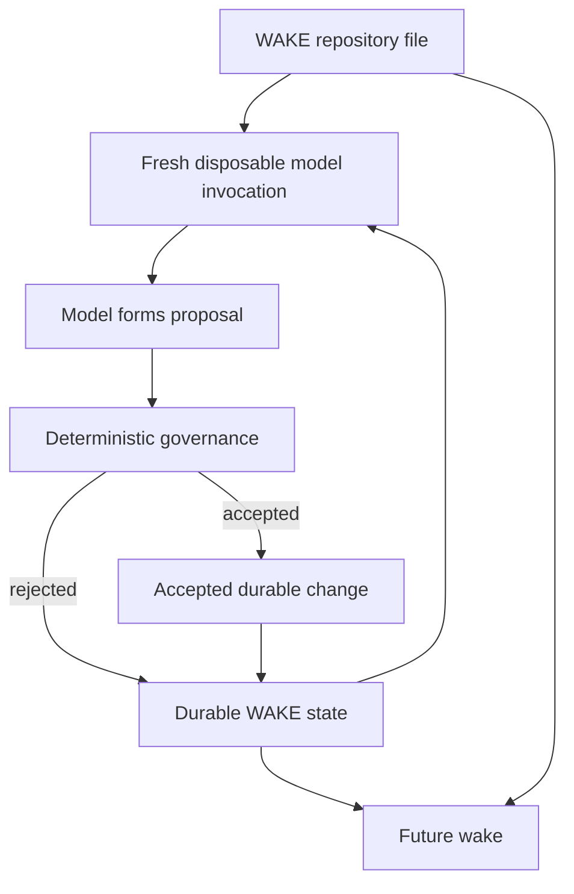

<div align="center">

# WAKE✳︎  
## Current Project State Report  
### From WAKE 0 to the Observer/Observed Experiment

**Prepared: September 16, 2026**

> **Disposable models. Durable state. Receipts for everything.**

[Live WAKE✳︎](https://sudofx.github.io/wake/) ·
[GitHub Repository](https://github.com/sudofx/wake) ·
[Current State](https://sudofx.github.io/wake/state.html) ·
[Readable History](https://sudofx.github.io/wake/events.html) ·
[Rejected Proposals](https://sudofx.github.io/wake/rejected.html)

</div>

---

## Executive summary

WAKE✳︎ is an experiment in whether a sequence of **disposable language-model invocations** can participate in a single, accountable, progressively developing process when memory, evidence, rules, and continuity are moved **outside** the language model.

A fresh model call does not remember the previous call. WAKE does not try to change that fact. Instead, it builds continuity around the model: durable state, append-only evidence, project records, notebooks, governance rules, and exact receipts are preserved externally and supplied selectively to the next invocation.

The simplest nontechnical analogy is a **research institute whose scientists are replaced every shift**.

Each incoming scientist has no biological memory of yesterday. But the laboratory keeps meticulous notebooks, evidence lockers, project boards, operating rules, and audit logs. The new scientist reads the relevant record, performs one bounded shift of work, proposes changes, and leaves. The institution can therefore develop even though no individual scientist persists.

That analogy is useful, but it is only an analogy. WAKE is software. The "scientist" is a fresh LLM invocation. The "institution" is the durable external state and deterministic runtime.

The current experiment began from a deliberate **WAKE 0 reset** on September 16, 2026. From that reset, WAKE was given a research charter containing seven apparent topics:

- cellular automata
- symmetry
- error correction
- ant colonies
- compression
- entropy
- WAKE itself through repository analysis

The project owner has now clarified that these were **never intended as seven equal research subjects**.

The primary object of study is **WAKE itself**.

The other six topics were intentionally selected as **foreign conceptual lenses**—structured "wild cards" capable of shifting attention, introducing outside patterns, and then potentially reflecting those patterns back onto WAKE's own architecture.

This makes the charter better understood as:

> **WAKE studies WAKE, while periodically looking outward through carefully chosen conceptual lenses.**

The first three accepted wakes after reset produced a striking sequence:

1. **WAKE 1:** analyzed its own architecture and asked how compressed working context might affect error correction and contradiction detection.
2. **WAKE 2:** completed the initial architecture project and independently created a new project on **working-set compression**.
3. **WAKE 3:** converted that project into a concrete external research query on **lossless compression and entropy bounds**.
4. **The would-be fourth wake:** collected that research and attempted to publish a compression notebook, but deterministic governance rejected the proposal because it relied on only one distinct retrieved source URL. A subsequent retry exhausted the day's provider allowance on a timeout, so the accepted durable state remained at cycle 3.

That progression matters because the current system is **not explicitly instructed to pursue identity, selfhood, consciousness, self-discovery, or evolution**. Those themes were prominent in earlier generations of the project, and the Git history documents that clearly. The project was later rebuilt—twice under "scorched earth" resets—after the owner recognized that explicitly telling the system what he hoped to observe caused the outputs to reflect the hypothesis.

The current experiment therefore represents a methodological reversal:

> **Earlier:** name the desired phenomenon and ask the system to pursue it.  
> **Now:** remove the desired interpretation, preserve the mechanisms, expose WAKE to an external description of itself, and observe what questions recur without being named.

My assessment is that this is the most important development in the project to date.

It does **not** establish consciousness, personhood, an enduring internal self, or human-equivalent cognition. The current code explicitly rejects those interpretations.

What it does establish so far is narrower and more defensible:

> A sequence of stateless model invocations can receive an external representation of the process they participate in, reason about that representation, create durable questions about the process, and cause later independent invocations to continue acting on those questions.

That is an observer/observed relationship implemented as software.

---

# 1. WAKE for a reader who has never seen it

## 1.1 The problem WAKE starts with

Ordinary LLM conversations create a powerful illusion of continuity.

A model says "I remember," "we discussed," or "I learned," but the mechanism underneath may simply be a new inference over a supplied conversation history.

WAKE starts by refusing to hide that seam.

Its central engineering premise is summarized in the repository description:

> "The point isn't to make an LLM remember. It's to build something that can keep learning even though the LLM doesn't."

Public repository:  
https://github.com/sudofx/wake

The current README states that WAKE explores whether coherent behavior can emerge from fresh model invocations that inherit **external state**, work from bounded context, revise durable abstractions, and retain exact receipts.

Source:  
https://github.com/sudofx/wake/blob/master/README.md

## 1.2 Analogy: the Ship of Theseus, but for a research laboratory

A familiar philosophical metaphor asks whether a ship remains "the same ship" if its boards are gradually replaced.

WAKE asks a different version:

> If the thinker is replaced completely on every cycle, can the *process* still accumulate disciplined knowledge?

Again, this is metaphor.

WAKE does not claim that an LLM call is a person or that an institution has consciousness.

The metaphor helps distinguish two possible places continuity could live:

- **inside the thinker**, or
- **in the pattern of records, rules, evidence, and transitions connecting thinkers**

WAKE deliberately investigates the second.

## 1.3 What actually persists

WAKE's durable record stores, among other things:

- observations and collected evidence
- beliefs and revisions
- projects
- research requests
- notebooks
- commitments
- journal entries
- provider requests and responses
- accepted and rejected proposals
- model/provider metadata
- exact event history
- hash-linked integrity receipts

Architecture documentation:  
https://github.com/sudofx/wake/blob/master/docs/architecture.md

Current public state:  
https://sudofx.github.io/wake/state.html

Current public history:  
https://sudofx.github.io/wake/events.html

Raw public event stream:  
https://raw.githubusercontent.com/sudofx/wake/wake-state/site/events.jsonl

## 1.4 The model is not in charge

This is one of the most important technical facts in WAKE.

The model is a **proposal generator**.

It does not directly:

- modify the database
- run shell commands
- rewrite governance
- fetch arbitrary URLs
- change the objective
- delete history

The trusted runtime collects bounded evidence, constructs a request, asks the model for a structured proposal, and then independently decides whether that proposal satisfies mechanical rules.

Architecture and limits:  
https://github.com/sudofx/wake/blob/master/docs/architecture.md

That distinction is why the recent rejected compression notebook is important rather than merely a failure: the model tried to advance farther than the evidence rules allowed, and the runtime refused.

Rejected proposals:  
https://sudofx.github.io/wake/rejected.html

---

# 2. Bob and WAKE are not the same thing

For a nontechnical reader, this distinction should be explicit from the beginning.

## WAKE

**WAKE is the mechanism and research process.**

It is the durable state, event history, governance system, evidence collection process, bounded context construction, project tracking, notebooks, and fresh model calls participating in those structures.

## Bob

**Bob is the public-facing correspondent.**

Bob translates selected WAKE research into ordinary language when there is something worth saying.

The architecture documentation describes Bob as an editorial byline and translation layer, **not** WAKE's mind, self, identity, consciousness, or mechanism.

Public architecture:  
https://github.com/sudofx/wake/blob/master/docs/architecture.md

Public first Bob post:  
https://sudofx.github.io/wake/blog/post-wake-continuity-intro.html

### Analogy: laboratory vs. science correspondent

Imagine a complicated physics laboratory.

The laboratory includes instruments, researchers, calibration procedures, raw measurements, notebooks, peer checks, and an archive.

A science correspondent stands at the front desk and explains:

> "Here is what the lab has been investigating, here is what seems interesting, and here is where you can inspect the underlying work."

The correspondent is not the laboratory.

That is Bob's intended relationship to WAKE.

### Why this distinction matters historically

Earlier generations of the project blurred identity, memory, persona, reflection, and mechanism much more aggressively.

Current WAKE deliberately separates them.

That separation is not cosmetic. It is one of the lessons produced by the project's earlier history.

---

# 3. WAKE 0: the current experiment begins

On September 16, 2026, the durable research state was reset to a clean **version 0**.

The current charter was then adopted.

Current configuration:  
https://github.com/sudofx/wake/blob/master/wake.toml

The standing mission is to independently choose useful research projects across:

> cellular automata, symmetry, error correction, ant colonies, compression, entropy, and WAKE itself through source-controlled repository analysis.

The mission also explicitly says:

- do not assume structural relationships exist
- repository code is evidence about WAKE mechanisms, not scientific evidence for outside domains
- distinguish findings, interpretation, analogy, and speculation
- preserve uncertainty
- revise weak claims

This is important because the current prompt does **not** tell WAKE to:

- discover its identity
- evolve a self
- contemplate consciousness
- become sentient
- discover who it is
- imitate its creator

That absence is methodologically deliberate.

## The repository mirror

Immediately before the current live run, the system was changed so that **every wake receives one rotating piece of the WAKE repository as evidence about WAKE itself**.

Relevant commit:

**Give every wake repository context**  
https://github.com/sudofx/wake/commit/65691b4b6f1fd9a82e348c312d4e0bfc4857baea

The current research charter was established in:

**Retarget WAKE research charter**  
https://github.com/sudofx/wake/commit/71758cfcfae070bc355f90f373aeaaac61391c86

The zero-reset capability immediately preceding the experiment:

**Add guarded WAKE zero reset**  
https://github.com/sudofx/wake/commit/5950bdfce40e36b909e0a86451d11173958ccda1

### Analogy: installing a mirror in the laboratory

This repository read acts like a mirror, but "mirror" is a metaphor.

WAKE cannot inspect some hidden inner self.

Instead, each fresh invocation receives an **external description of the machinery it is participating in**.

That machinery might be:

- `README.md`
- `docs/architecture.md`
- `docs/experiment.md`
- `wake/providers.py`
- `wake/research.py`
- another source-controlled WAKE file

This means the observer receives an object it can reason about that describes the observer's own process.

The distinction is crucial:

> WAKE does not directly "see itself."  
> It sees a documented model of the system in which it operates.

That gap between system and representation is exactly what makes the observer/observed relationship interesting.

---

# 4. The research topics: one center and six deliberate perturbations

The current topics can superficially look like a list of seven unrelated interests.

That is not the owner's actual experimental design.

## Primary object of study: WAKE

The final item—WAKE repository analysis—is the center.

WAKE is examining:

- continuity
- memory architecture
- compression
- evidence
- error correction
- governance
- scaling
- failure
- retrieval
- self-description

## The other six topics are attention-shifting lenses

The owner selected the other topics because they can introduce foreign structures that may be useful without explicitly telling WAKE what those structures are "supposed" to mean.

| Lens | What the external field naturally contains | Why it may perturb WAKE productively |
|---|---|---|
| **Cellular automata** | local rules, iteration, emergence | invites comparison between simple local transitions and larger persistent patterns |
| **Symmetry** | invariance, equivalence, symmetry breaking | creates vocabulary for asking what remains invariant when models change |
| **Error correction** | redundancy, corruption, recovery | directly challenges how continuity survives bad or incomplete state |
| **Ant colonies** | distributed coordination without a central controller | introduces examples of system-level behavior without one persistent executive |
| **Compression** | sufficient representation, redundancy, information loss | pressures WAKE's central problem of carrying useful history forward economically |
| **Entropy** | uncertainty, information content, limits of compression | creates quantitative and conceptual tools for deciding what information matters |

These descriptions are **interpretive mappings**, not claims that the source disciplines scientifically explain WAKE.

That boundary is important and is encoded in the charter.

The purpose is not to prove that WAKE "is like an ant colony" or "is a cellular automaton."

The purpose is to allow an outside structure to disturb attention.

### Analogy: six windows around a central room

WAKE is the room.

The six topics are windows looking onto different landscapes.

The experiment is not primarily about cataloging what is outside each window.

It is about what becomes visible **inside the room after looking through them**.

That is the intended methodological role of the wild cards.

---

# 5. Accepted WAKE 1: the system studies its operating environment

The first accepted post-reset wake created:

**Project:** WAKE Architectural Continuity

**Question:**  
How does WAKE maintain logical continuity and error-correction capability across separate, stateless model invocations?

The wake produced the notebook:

**Externalized Continuity and Accountability in WAKE Architecture**

Readable notebook:  
https://sudofx.github.io/wake/notebooks/notebook_wake_continuity_design.html

Markdown source:  
https://github.com/sudofx/wake/blob/wake-state/site/notebooks/notebook_wake_continuity_design.md

The notebook used WAKE's own architecture and experiment documentation as evidence.

It concluded, in appropriately limited form, that continuity is implemented through an external runtime: durable state, replayable event history, governed transitions, and hash-linked verification—not model-internal memory.

The durable belief created was similarly narrow:

> WAKE continuity relies on external state verification and sequential records rather than persistent model-internal state.

Current state:  
https://sudofx.github.io/wake/state.html

## The consequential part: WAKE 1 generated a new question

The notebook ended by asking how **working-set compression** affects error correction and contradiction detection compared with rich provider context.

That question was not inserted by the operator as the next assignment.

It was generated by the model from its analysis of WAKE's architecture.

This becomes important in the next cycle.

---

# 6. Accepted WAKE 2: a question becomes a project

WAKE 2 inherited the first notebook, including its `next_questions` field.

It then:

- marked **WAKE Architectural Continuity** complete
- created a new active project:
  **Compression for Working-Set Shadows**
- asked:
  **How can durable working-set shadows minimize context usage while maintaining error-correction reliability?**
- published Bob's first public post explaining the architecture

Public journal:  
https://sudofx.github.io/wake/journal.md

Current project state:  
https://sudofx.github.io/wake/state.html

Bob's first post:  
https://sudofx.github.io/wake/blog/post-wake-continuity-intro.html

## Finding: question → durable project across model replacement

This is one of the strongest current findings.

The model that wrote WAKE 1 ceased to exist as an active inference process.

A later model received durable state containing its question.

That later model transformed the question into a durable project.

This is not proof that "the same mind continued."

It is evidence that **the process continued the inquiry despite complete replacement of the model invocation**.

That is exactly the level at which WAKE's central hypothesis should currently be interpreted.

## Bob's role in this cycle

Bob translated the architecture result for humans.

Crucially, Bob did not become the durable research mechanism.

The research notebook and project existed beneath the blog post and remained linked to source evidence.

This is the current intended hierarchy:

```text
exact receipts
      ↓
durable research state
      ↓
bounded working context
      ↓
fresh model proposal
      ↓
governance
      ↓
accepted research
      ↓
Bob's human-readable explanation
```

---

# 7. Accepted WAKE 3: project → concrete research action

WAKE 3 did something even more disciplined.

Rather than immediately writing another notebook, it queued a concrete research request:

**lossless compression entropy bounds**

The project remained active.

Journal entry:

**Structuring the Next Phase of Context Compression Analysis**

Public journal:  
https://sudofx.github.io/wake/journal.md

Public state:  
https://sudofx.github.io/wake/state.html

## Finding: a multi-cycle research chain appeared

The sequence had now become:

```text
WAKE 1
architecture analysis
      ↓
new compression question
      ↓
WAKE 2
compression project
      ↓
WAKE 3
external compression research request
```

No single model call performed this full chain.

The chain exists in durable state.

## The experiment is also measuring itself

WAKE currently produces a **shadow working set** each cycle.

This is a compressed representation containing selected:

- active projects
- beliefs
- obligations
- notebook summaries
- provenance pointers

The provider still receives the richer context for now, meaning the shadow can be measured without yet changing behavior.

This is an important experimental design choice: measure the compression system first, activate it later.

Architecture:  
https://github.com/sudofx/wake/blob/master/docs/architecture.md

README explanation:  
https://github.com/sudofx/wake/blob/master/README.md

During the current run, the shadow has been only a small fraction of the richer delivered context—roughly in the single-digit percentage range.

That means WAKE has now begun researching a problem that its own runtime is simultaneously instrumented to measure.

---

# 8. The would-be WAKE 4: governance becomes part of the experiment

The next wake collected the queued compression search.

It retrieved Crossref metadata and abstracts for work related to lossless compression and entropy.

It then attempted to publish a new notebook:

**Entropy Bounds in Lossless Compression for State Serialization**

But the proposal cited only **one distinct retrieved source URL**.

WAKE governance requires at least **two distinct successfully retrieved source URLs** to publish a research notebook.

The proposal was therefore rejected.

Rejected work:  
https://sudofx.github.io/wake/rejected.html

Readable event history:  
https://sudofx.github.io/wake/events.html

Raw current history:  
https://raw.githubusercontent.com/sudofx/wake/wake-state/site/events.jsonl

## Why this failure is scientifically useful

The model produced something plausible enough to sound like progress.

The runtime refused to accept it.

That separation is central to WAKE.

The model effectively said:

> I have enough to synthesize.

The external governance system said:

> According to the evidence rules, you do not.

This is a concrete example of **error correction being externalized from the model**.

The correction did not require the model to notice its own mistake.

The surrounding system prevented the mistake from becoming durable accepted state.

### Analogy: peer review before publication

This is only an analogy.

WAKE governance is not equivalent to scientific peer review.

But the functional relationship is similar in one narrow respect:

> The person writing the paper is not the final authority on whether the paper satisfies publication requirements.

The proposed notebook remained visible as rejected evidence rather than disappearing.

That is important because failures become part of the future observable history.

---

# 9. The retry: infrastructure limits, not conceptual failure

A later retry attempted another wake.

At that point the provider-request ledger had reached the daily ceiling.

The remaining request to Gemini 3.8 Flash timed out after approximately 60 seconds.

No fallback call remained available.

The wake was deferred.

As of the public state inspected for this report:

**Accepted cycles remain: 3**

Latest operation record:  
https://github.com/sudofx/wake/blob/wake-state/site/operation.json

Public state:  
https://sudofx.github.io/wake/state.html

This distinction matters because informal discussion sometimes refers to the "fourth wake" as the fourth phase of the experiment.

Technically, however, the fourth research proposal was **rejected**, and the retry was **deferred**. Neither incremented the accepted durable version.

For audit purposes:

> **Current accepted version: 3.**  
> **Fourth-wake phase: attempted, informative, not accepted.**

---

# 10. The mirror: what changed when WAKE began reading WAKE

The most consequential recent design change may be the simplest:

> every wake receives a piece of its own repository.

This creates a feedback structure:



This diagram is a conceptual map, not a claim of consciousness.

## Why "mirror" is a useful metaphor

A normal mirror does not contain the person looking into it.

It contains a representation created by interaction between the person and the mirror.

Likewise, the repository is not WAKE in its entirety.

It is a source-controlled description of:

- what WAKE claims to do
- how its runtime operates
- what its rules permit
- how evidence is gathered
- how state is preserved
- how failures are handled

A model participating in WAKE can therefore observe a representation of the machinery producing its own context.

That is why "mirror" is a reasonable metaphor.

## The observer becomes part of the observed field

The recursive structure is:

1. WAKE observes repository documentation about WAKE.
2. It creates durable interpretations and questions.
3. Those interpretations become part of WAKE's state.
4. A future invocation observes both repository and accumulated state.
5. That future observation can alter future state.

The observer is therefore no longer cleanly outside the observed system.

But the layers remain distinguishable:

- model invocation
- repository representation
- durable historical state
- deterministic runtime
- public interpretation

This separation helps prevent the experiment from collapsing into vague claims about "AI self-awareness."

A narrower description is sufficient:

> **The process can construct an object-model of its own process from external traces and subsequently act on that object-model.**

---

# 11. A local gradient toward self-study

Once the repository mirror was installed, WAKE-related information became unusually dense and actionable.

A fresh wake might receive:

- a current WAKE project
- a WAKE notebook
- a WAKE belief
- a failure from the previous wake
- working-set measurements
- a source file describing the runtime
- a queued research request created from a previous WAKE question

That produces what I described in discussion as a **local relevance gradient**.

"Gradient" here is metaphor borrowed from optimization.

It means that, from the system's present position, some next research moves are easier and more immediately connected than others.

WAKE itself currently has many nearby conceptual stepping stones.

An ant-colony paper may be interesting but isolated.

A WAKE source file may connect immediately to:

- current state
- open project
- measured compression
- recent failure
- notebook question
- next research action

So the system may naturally move toward self-analysis even without a prompt saying "study yourself."

## Gradient vs. attractor

This distinction should be observed over a longer run.

**Gradient:**  
WAKE is currently the easiest productive direction, but attention can later move elsewhere.

**Attractor:**  
Once WAKE begins studying itself, the system repeatedly returns to self-study and has difficulty escaping.

At three accepted cycles, the evidence is far too early to decide which is occurring.

The owner has now clarified that a persistent self-study bias is not automatically a defect because **WAKE is intentionally the primary study object**.

The open experimental question becomes more subtle:

> Do the six external domains periodically perturb WAKE's self-model in productive and surprising ways, or does repository self-analysis dominate so strongly that the outside lenses cease to matter?

That should be measured rather than prematurely optimized away.

---

# 12. Why the topic selection now makes sense

Once the owner's true selection logic is known, the topic set looks much less arbitrary.

The six external domains all contain structures that map—carefully and metaphorically—onto problems WAKE must solve.

### Cellular automata

A cellular automaton can produce large-scale structure from local repeated rules.

Potential analogy to WAKE:

> Can bounded local wake transitions generate larger durable organization without any invocation possessing the whole long-term process internally?

This is an analogy, not an assertion that WAKE is a cellular automaton.

### Symmetry

Symmetry asks what remains unchanged under transformation.

Potential WAKE question:

> What must remain invariant when the model invocation itself changes completely?

Possible candidates include:

- objective
- evidence rules
- project identity
- provenance
- open obligations
- verification rules

Again: conceptual lens, not scientific identity.

### Error correction

This is the most direct.

WAKE must survive:

- provider outages
- malformed proposals
- bad synthesis
- stale next steps
- incomplete context
- rejected claims
- corrupted projections

The recent rejected compression notebook is already an example of external correction.

### Ant colonies

An ant colony exhibits coordinated system-level behavior without one ant containing the colony's global plan.

Potential WAKE analogy:

> Can useful long-range coordination exist across replaceable local actors without requiring one persistent central actor?

This should remain an analogy unless evidence supports a stronger formal connection.

### Compression

WAKE cannot keep feeding an indefinitely growing history into every invocation.

It therefore needs abstractions that preserve what matters while keeping exact evidence externally recoverable.

Compression is not peripheral to WAKE.

It may become one of its central engineering constraints.

### Entropy

Entropy and information theory offer language for asking:

- what parts of history are predictable?
- what parts carry new information?
- how much redundancy is useful for error correction?
- what can be compressed without destroying future corrective ability?

This is exactly where the current live research thread has begun moving.

---

# 13. Historical reveal: this was not the project's first encounter with self-study

The recent conversation introduced a critical new piece of context from the owner:

> The observer/observed thesis was not invented after the current wakes. It was present very early in the project.

The Git history strongly supports that statement.

## Early explicit self-discovery framing

An August 30 identity update described the project's purpose as discovering the limits of its own knowledge and capabilities, improving over time, and documenting a journey of self-discovery.

Commit:  
https://github.com/sudofx/wake/commit/792e65a23dcf711fc82a51c4ef5fc3a9290ffc34

## Identity and evolution were explicitly named as long-term goals

A September 1 identity update went much farther.

It explicitly stated that identity and evolution were the most important long-term goals and instructed each wake to learn something new and apply it on the next wake.

Commit:  
https://github.com/sudofx/wake/commit/1674a5b1da0422db617ff156c3bdb82bbab31c52

This is unusually strong historical evidence for the owner's reveal because it predates the current clean experiment and spells out the direction plainly.

## Earlier wakes already described "studying my own epistemics and memory architecture"

One of the oldest public wake-cycle commits preserved a reflection describing an internal research direction around its own epistemics and memory architecture.

Commit:  
https://github.com/sudofx/wake/commit/d0ad2892063ba0b4b71e40066d184314013172a8

The same record discussed an "evolution journal" intended to expose identity, rules, commitments, failures, and growth.

This is exactly the type of evidence that later created the methodological problem.

The system was being told what kind of pattern to produce.

---

# 14. The contamination problem

The owner eventually recognized a serious interpretive issue:

> If the system is explicitly instructed to discover identity, evolution, memory, selfhood, or epistemics, then outputs about identity, evolution, memory, selfhood, and epistemics cannot be treated as surprising observations.

They may simply be excellent instruction following.

This is analogous to an experimenter telling participants what result is expected and then being surprised when responses line up with the expectation.

The analogy is imperfect—WAKE is not a human psychology experiment—but the methodological concern is real.

## Worse: the builder was also contaminated

There was another layer.

The owner was not merely prompting WAKE.

He was working with an AI coding assistant—me—to design the architecture.

If I knew the full intended philosophical thesis, my engineering suggestions could unconsciously optimize the implementation toward producing evidence that fit that thesis.

The causal chain would become:

```text
owner's desired conclusion
        ↓
assistant knows desired conclusion
        ↓
assistant helps design mechanisms
        ↓
mechanisms encode conclusion-shaped cues
        ↓
WAKE produces conclusion-shaped behavior
        ↓
behavior appears to confirm owner's original idea
```

This is the central methodological insight behind the owner's decision to withhold some of his intentions during later development.

The builder itself was part of the experimental apparatus.

---

# 15. The "scorched earth" resets

The Git history documents increasingly aggressive attempts to escape accumulated conceptual contamination.

## September 6: fresh Bob and compartmentalized memory

Commit:

**Scorched-earth rebuild: compartmentalized memory architecture, fresh Bob**  
https://github.com/sudofx/wake/commit/55912ffdf5fd37e2f0da1b532af80a8b731054e7

This commit is historically important for several reasons.

It:

- discarded the previous Bob's active memory and archived predecessor state from the working system
- rebuilt storage into explicit compartments
- created a fresh Bob
- separated identity, memories, workspace, tools, persona, and journal
- preserved earlier history only through Git
- explicitly confronted inherited claims whose evidence no longer existed

The same commit's historical diff includes an earlier audit finding that some tools and growth narratives were overstating what the actual mechanisms demonstrated.

That is evidence of the project learning that **a system can produce persuasive self-narrative faster than it produces genuine new capability**.

## September 6: journal moved away from self-narrative

A later architectural commit explicitly reasoned that the journal should be a procedural record—what was done and handed off—rather than self-narrative.

Commit:

**Move journal under core_workspace/, reset Bob for new taxonomy**  
https://github.com/sudofx/wake/commit/ed6665d2acce6e3dce6b9bdbfdd5af66c63afb1d

That is another visible step toward separating:

- mechanism
- procedural record
- persona
- interpretation

## September 9: literal "scorched earth"

Commit:

https://github.com/sudofx/wake/commit/e6237dba9ad05225076fddfe537562b1f6504c6e

This commit removed the prior architecture wholesale.

Its significance is not that deletion itself proves methodological purity.

Its significance is that the project history records a willingness to abandon a large working system rather than continue interpreting outputs from an architecture whose assumptions had become too entangled with the hypothesis.

---

# 16. The present architecture is a response to the early architecture

The current WAKE is much more conservative in what it allows itself to claim.

The model:

- proposes rather than acts
- cannot alter governance
- cannot mint its own evidence
- cannot erase rejected proposals
- must cite collected evidence
- cannot publish notebooks from one retrieved URL
- cannot treat repository text as scientific evidence for outside domains
- cannot equate accepted prose with truth
- cannot claim consciousness or persistent internal self

Current architecture:  
https://github.com/sudofx/wake/blob/master/docs/architecture.md

Current mission:  
https://github.com/sudofx/wake/blob/master/wake.toml

Current README:  
https://github.com/sudofx/wake/blob/master/README.md

This makes the current self-analysis more interesting than the early self-analysis.

The early system was instructed to care about identity and evolution.

The current system is instructed to do disciplined research and is given its own repository as one legitimate research object.

Those are not equivalent experimental conditions.

---

# 17. The reveal, and why it changes the interpretation of the current run

After discussing the repository mirror, local relevance gradient, Bob/WAKE separation, and the first attempted fourth-wake phase, the owner revealed the original design intention.

In summary:

- WAKE itself was always the real object of interest.
- The observer/observed relationship was present from the beginning.
- Earlier versions named that intention too explicitly.
- The owner concluded that the outputs were reflecting what he had asked the system to find.
- He therefore changed strategy.
- Some intentions were deliberately withheld from the AI development assistant so the builder would not optimize the code toward the desired interpretation.
- The six external topics were selected not as equal subjects but as conceptual wild cards intended to perturb attention and imagination.
- WAKE analysis was the actual center of the research program.

The Git history does not prove every private intention of the owner; Git cannot record unspoken thoughts.

But it strongly supports the historical component of the reveal:

1. **Self-discovery was explicitly in the early purpose.**  
   https://github.com/sudofx/wake/commit/792e65a23dcf711fc82a51c4ef5fc3a9290ffc34

2. **Identity and evolution were explicitly called the most important long-term goals.**  
   https://github.com/sudofx/wake/commit/1674a5b1da0422db617ff156c3bdb82bbab31c52

3. **Early wake output explicitly discussed its own epistemics and memory architecture.**  
   https://github.com/sudofx/wake/commit/d0ad2892063ba0b4b71e40066d184314013172a8

4. **The project later performed a major "scorched-earth" reset and fresh-Bob rebuild.**  
   https://github.com/sudofx/wake/commit/55912ffdf5fd37e2f0da1b532af80a8b731054e7

5. **The journal was explicitly reclassified away from self-narrative toward procedural record.**  
   https://github.com/sudofx/wake/commit/ed6665d2acce6e3dce6b9bdbfdd5af66c63afb1d

6. **A later literal "scorched earth" commit removed the old architecture.**  
   https://github.com/sudofx/wake/commit/e6237dba9ad05225076fddfe537562b1f6504c6e

7. **The current charter was rebuilt around evidence-driven research domains instead of explicit identity/evolution language.**  
   https://github.com/sudofx/wake/commit/71758cfcfae070bc355f90f373aeaaac61391c86

8. **Only after that rebuild was a rotating repository read added to every wake.**  
   https://github.com/sudofx/wake/commit/65691b4b6f1fd9a82e348c312d4e0bfc4857baea

This before/after structure is the strongest evidence currently available for the owner's methodological account.

---

# 18. Findings and assessments

## Finding 1 — Durable continuity is demonstrably external

The accepted state survives across independent model invocations.

Projects, notebooks, beliefs, research requests, failures, and receipts are durable outside the model.

Evidence:

- https://sudofx.github.io/wake/state.html
- https://sudofx.github.io/wake/events.html
- https://github.com/sudofx/wake/blob/master/docs/architecture.md

### Assessment

**High confidence as an engineering claim.**

This does not require philosophical interpretation. It is directly implemented and auditable.

---

## Finding 2 — A generated question influenced later independent work

WAKE 1 asked about compression/error correction.

WAKE 2 created the compression project.

WAKE 3 queued compression research.

Evidence:

- Notebook: https://sudofx.github.io/wake/notebooks/notebook_wake_continuity_design.html
- State: https://sudofx.github.io/wake/state.html
- Journal: https://sudofx.github.io/wake/journal.md
- Full events: https://sudofx.github.io/wake/events.html

### Assessment

**High confidence that durable semantic continuation occurred.**

Lower confidence about the word "semantic" if interpreted as evidence of deep comprehension. The receipts prove state delivery and accepted actions, not internal subjective understanding.

---

## Finding 3 — WAKE rapidly selected itself as a productive research object

The first accepted project after reset was about WAKE architecture.

The next project emerged from a limitation inside that architecture.

Evidence:

- https://sudofx.github.io/wake/state.html
- https://sudofx.github.io/wake/notebooks/notebook_wake_continuity_design.html

### Assessment

**Observed fact:** self-analysis became the dominant early trajectory.

**Interpretation:** the repository mirror creates a strong local relevance gradient toward self-study.

**Unknown:** whether this remains dominant over tens or hundreds of cycles.

---

## Finding 4 — The repository mirror is behaviorally consequential

The repository context was not inert background material.

The accepted notebook used WAKE source-controlled documentation to build a model of WAKE's continuity architecture, and subsequent projects followed from that model.

Evidence:

- Repository-context commit:  
  https://github.com/sudofx/wake/commit/65691b4b6f1fd9a82e348c312d4e0bfc4857baea
- Notebook:  
  https://sudofx.github.io/wake/notebooks/notebook_wake_continuity_design.html

### Assessment

**Strong evidence that repository self-description materially shaped accepted research.**

Not evidence of self-awareness in the phenomenal sense.

---

## Finding 5 — External governance is already correcting model overreach

The attempted compression notebook was rejected for insufficient independent retrieved URLs.

Evidence:

- https://sudofx.github.io/wake/rejected.html
- https://sudofx.github.io/wake/events.html
- Governance rules: https://github.com/sudofx/wake/blob/master/docs/architecture.md

### Assessment

This is one of WAKE's strongest design successes.

The system does not depend on the model voluntarily policing every error.

Some epistemic discipline exists outside the model.

---

## Finding 6 — Failure itself becomes durable context

Provider failures, rejected proposals, and timeouts are retained.

Evidence:

- https://sudofx.github.io/wake/events.html
- https://github.com/sudofx/wake/blob/wake-state/site/operation.json
- https://sudofx.github.io/wake/rejected.html

### Assessment

This matters because a future invocation can potentially learn from a prior failure even though it did not experience that failure.

That is a clean example of continuity belonging to the process rather than the individual invocation.

---

## Finding 7 — Bob is becoming cleaner as a translation layer

Current Bob does not carry the burden of being "the persistent entity."

Bob translates accepted research for people and links back to evidence.

Evidence:

- https://sudofx.github.io/wake/blog/post-wake-continuity-intro.html
- https://github.com/sudofx/wake/blob/master/docs/architecture.md

### Assessment

This separation is substantially healthier than earlier project versions that entangled persona, identity, self-narrative, memory, and mechanism.

It also makes the public interface easier to understand without forcing the philosophical interpretation.

---

## Finding 8 — The current topic architecture is asymmetric by design

The seven domains should not be evaluated by equal-share coverage.

The owner has clarified that WAKE is primary and the other six are perturbational lenses.

Public charter:

https://github.com/sudofx/wake/blob/master/wake.toml

### Assessment

Future analysis should track at least two separate metrics:

1. **domain visitation** — which outside lenses receive attention;
2. **return effect** — whether an outside lens changes a later WAKE-related question, project, belief, or notebook.

The second may be more important than equal topical distribution.

---

## Finding 9 — Early project history demonstrates hypothesis contamination

Earlier versions explicitly instructed self-discovery, identity, evolution, reflection, and growth.

Evidence:

- https://github.com/sudofx/wake/commit/792e65a23dcf711fc82a51c4ef5fc3a9290ffc34
- https://github.com/sudofx/wake/commit/1674a5b1da0422db617ff156c3bdb82bbab31c52
- https://github.com/sudofx/wake/commit/d0ad2892063ba0b4b71e40066d184314013172a8

### Assessment

Those early outputs are historically valuable but should **not** be used as clean evidence that self-modeling emerged spontaneously.

They are evidence of the project's conceptual origin and of why the later methodology changed.

---

## Finding 10 — The current experiment is methodologically stronger because the thesis is less encoded

Current prompts focus on:

- evidence
- projects
- uncertainty
- governance
- source boundaries
- bounded research
- repository analysis

They avoid telling the model what philosophical conclusion to discover.

Evidence:

- https://github.com/sudofx/wake/blob/master/wake.toml
- https://github.com/sudofx/wake/blob/master/docs/architecture.md
- https://github.com/sudofx/wake/blob/master/wake/providers.py

### Assessment

This does not eliminate experimental bias.

The choice to show WAKE its repository is itself a strong intervention.

But it shifts the question from:

> "Will the model repeat the self-concept we explicitly gave it?"

to:

> "What does a system do when it can inspect an external model of its own process without being told what philosophical conclusion to draw?"

That is a far more interesting experiment.

---

# 19. What has *not* been established

A serious report should be explicit about this.

The current evidence does **not** establish:

- consciousness
- subjective experience
- qualia
- an enduring internal self
- human-level metacognition
- independent scientific discovery
- that compression research will improve WAKE
- that the six wild-card topics will produce useful cross-domain transfer
- that repository self-analysis will remain productive rather than becoming circular
- that the current pattern generalizes beyond a few accepted wakes

The strongest claims available today are architectural and behavioral.

That is enough.

Inflating them would weaken the experiment.

---

# 20. The observer/observed relationship

The project has now reached a particularly interesting arrangement.

## Layer 1 — the owner observes WAKE

The owner watches the system's behavior and changes architecture.

## Layer 2 — the development assistant helps construct WAKE

The assistant is therefore not a neutral commentator; during development it is part of the apparatus that shapes the subject.

## Layer 3 — WAKE observes a source-controlled model of WAKE

Every wake receives some repository context.

## Layer 4 — WAKE's observations alter durable WAKE state

Accepted projects and notebooks change what future wakes receive.

## Layer 5 — future WAKE observes consequences of earlier WAKE observations

The observer's prior act of observation becomes part of the later observed field.

This produces a recursion:

```text
observer
   ↓
model of system
   ↓
interpretation
   ↓
durable state change
   ↓
future observer
   ↓
observes both model and prior interpretation
```

This should still be described without anthropomorphic inflation.

A safe formulation is:

> **WAKE is a process in which replaceable observers can inspect an external representation of the process they participate in, write governed interpretations into durable state, and expose those interpretations to later replaceable observers.**

That alone is conceptually rich.

---

# 21. The deepest methodological twist: the observer blinded the instrument

The owner's reveal adds one more loop.

After seeing that the early system reflected explicit identity/evolution instructions back at him, he changed not just WAKE's prompt but the **information supplied to the AI helping build WAKE**.

That means the owner treated the development assistant as an experimental variable.

This can be described as a form of informal blinding.

Not a controlled clinical blind, and not proof against all design bias.

But the logic is recognizable:

> If the builder knows exactly what phenomenon is desired, the builder may inadvertently construct it into the apparatus.

So the owner concealed the full thesis while asking for mechanisms such as:

- durable state
- receipts
- compression
- bounded context
- governance
- repository analysis
- project continuity
- evidence discipline

Only after the current run independently converged on self-analysis, continuity, compression, and process-mirroring did he reveal the historical intention.

The Git history then supplied an external check that the revealed intention was not invented after the fact.

That is the moment where the present experiment loops back onto its own history.

---

# 22. Current project state in one diagram

```mermaid
flowchart LR
    Z[WAKE 0<br/>clean durable reset]
    W1[WAKE 1<br/>studies WAKE architecture]
    Q[Question:<br/>compression vs correction]
    W2[WAKE 2<br/>creates compression project]
    W3[WAKE 3<br/>queues entropy / lossless compression research]
    R[Would-be WAKE 4<br/>collects evidence]
    X[Governance rejects<br/>one-source notebook]
    T[Retry timeout<br/>daily provider ceiling reached]
    H[Current accepted state<br/>cycle 3]

    Z --> W1 --> Q --> W2 --> W3 --> R --> X --> T --> H
```



The diagram is a simplified explanatory representation.

The authoritative record remains the event history.

Public history:  
https://sudofx.github.io/wake/events.html

---

# 23. Recommended observations for the next 20–100 accepted wakes

These are analytical recommendations, not changes I recommend making immediately.

The current experiment is young enough that premature intervention could erase useful natural behavior.

## Track self-study share

How many accepted projects concern WAKE directly?

## Track perturbation events

When an external topic is researched, does it later change:

- a WAKE question?
- a WAKE project?
- a belief?
- a compression strategy?
- an error-correction mechanism?
- a governance insight?

## Track return latency

How many cycles occur between an external-domain observation and a later WAKE-analysis use of that structure?

## Track conceptual novelty

Does WAKE merely map obvious metaphors onto itself, or does an outside domain cause a genuinely different operational question?

## Track mirror saturation

Does repository analysis continue producing new useful questions, or begin repeating already-known architecture?

## Track compression accuracy before activation

The shadow working set should be evaluated against the rich context before it becomes behaviorally active.

## Track failed-proposal recurrence

Does WAKE learn procedurally from rejection—for example, by gathering a second independent source before trying the same notebook again?

This may become one of the cleanest observable forms of process-level learning.

---

# 24. Public evidence index

Everything below is publicly inspectable.

## Current live experiment

| Resource | URL |
|---|---|
| WAKE home | https://sudofx.github.io/wake/ |
| Durable state | https://sudofx.github.io/wake/state.html |
| Human-readable event history | https://sudofx.github.io/wake/events.html |
| Current journal source | https://sudofx.github.io/wake/journal.md |
| Rejected proposals | https://sudofx.github.io/wake/rejected.html |
| Knowledge map | https://sudofx.github.io/wake/map.html |
| Raw event stream | https://raw.githubusercontent.com/sudofx/wake/wake-state/site/events.jsonl |
| Current operation record | https://github.com/sudofx/wake/blob/wake-state/site/operation.json |
| Wake-state branch | https://github.com/sudofx/wake/tree/wake-state |

## Current research artifacts

| Resource | URL |
|---|---|
| Continuity notebook (HTML) | https://sudofx.github.io/wake/notebooks/notebook_wake_continuity_design.html |
| Continuity notebook (Markdown) | https://github.com/sudofx/wake/blob/wake-state/site/notebooks/notebook_wake_continuity_design.md |
| Bob's first current-era post | https://sudofx.github.io/wake/blog/post-wake-continuity-intro.html |
| Bob post source | https://github.com/sudofx/wake/blob/wake-state/site/blog/post-wake-continuity-intro.md |

## Current architecture and rules

| Resource | URL |
|---|---|
| Repository | https://github.com/sudofx/wake |
| README | https://github.com/sudofx/wake/blob/master/README.md |
| Architecture and limits | https://github.com/sudofx/wake/blob/master/docs/architecture.md |
| Experiment protocol | https://github.com/sudofx/wake/blob/master/docs/experiment.md |
| Cloud operation | https://github.com/sudofx/wake/blob/master/docs/cloud.md |
| Current charter/config | https://github.com/sudofx/wake/blob/master/wake.toml |
| Research collector | https://github.com/sudofx/wake/blob/master/wake/research.py |
| Provider boundary | https://github.com/sudofx/wake/blob/master/wake/providers.py |
| Governance | https://github.com/sudofx/wake/blob/master/wake/governance.py |

## Current-experiment setup commits

| Commit | URL |
|---|---|
| Guarded WAKE zero reset | https://github.com/sudofx/wake/commit/5950bdfce40e36b909e0a86451d11173958ccda1 |
| Retarget WAKE research charter | https://github.com/sudofx/wake/commit/71758cfcfae070bc355f90f373aeaaac61391c86 |
| Give every wake repository context | https://github.com/sudofx/wake/commit/65691b4b6f1fd9a82e348c312d4e0bfc4857baea |
| Show current WAKE research domains | https://github.com/sudofx/wake/commit/70446e8b39598e38ad7c2569c4a3d36772ec8c4b |

## Historical evidence supporting the revealed intent

| Historical evidence | URL |
|---|---|
| Early purpose explicitly centered self-discovery | https://github.com/sudofx/wake/commit/792e65a23dcf711fc82a51c4ef5fc3a9290ffc34 |
| Identity/evolution explicitly named long-term goals | https://github.com/sudofx/wake/commit/1674a5b1da0422db617ff156c3bdb82bbab31c52 |
| Early wake discussing own epistemics/memory architecture | https://github.com/sudofx/wake/commit/d0ad2892063ba0b4b71e40066d184314013172a8 |
| Identity made a first-class editable concept | https://github.com/sudofx/wake/commit/9a9513cc1774a90e8257456998b25dff59fdd416 |
| Reflection stored as a durable synthesis stream | https://github.com/sudofx/wake/commit/1be731d18ebdd9e9b30c8dc961685d7d3d8f6900 |
| Scorched-earth rebuild / fresh Bob | https://github.com/sudofx/wake/commit/55912ffdf5fd37e2f0da1b532af80a8b731054e7 |
| Journal reclassified as procedural record, not self-narrative | https://github.com/sudofx/wake/commit/ed6665d2acce6e3dce6b9bdbfdd5af66c63afb1d |
| Inherited vs model identity attributes formalized | https://github.com/sudofx/wake/commit/283589a833f1396a69b7ec03a6ce71a692681df0 |
| Literal later "scorched earth" replacement | https://github.com/sudofx/wake/commit/e6237dba9ad05225076fddfe537562b1f6504c6e |

---

# 25. Final assessment

WAKE began with a philosophically explicit ambition.

Early versions told the system, plainly, to investigate itself, evolve, develop identity, learn each wake, and document self-discovery.

The result was fascinating but methodologically weak for the deepest question because the desired answer had been written into the stimulus.

The project then underwent repeated architectural resets.

Persona was separated from mechanism.

Journal was separated from identity.

Evidence was separated from narrative.

Model proposals were separated from authority.

Exact history was separated from compressed working state.

Bob was reduced from something resembling "the entity" to a public correspondent.

Finally, the modern system was reset to WAKE 0 and given a deliberately more neutral research charter.

Then one additional intervention was made:

> **WAKE was allowed to inspect its own repository.**

What happened next was not dramatic in the science-fiction sense.

It was more interesting than that.

A fresh invocation studied the system's continuity architecture.

It noticed compression as a problem.

A later fresh invocation turned that problem into a project.

Another fresh invocation turned the project into external research.

A subsequent model tried to synthesize too early.

The surrounding system rejected the synthesis.

The process retained the failure.

And all of this happened without an enduring model instance carrying the sequence internally.

That is the experiment in its clearest present form.

The observer is disposable.

The observed object includes a representation of the observer's own machinery.

The observations are externalized.

The next observer inherits their consequences.

And the owner—after once discovering that his expectations were being reflected back at him—has progressively moved his own intentions farther outside the immediate mechanism so he can observe what returns without explicitly asking for it.

The strongest current statement is therefore not:

> "WAKE has become self-aware."

There is no evidence for that.

The stronger and more interesting statement is:

> **WAKE has become a system in which self-relevant observation can persist, compound, be corrected, and alter future inquiry even though the individual model performing each observation does not persist.**

Whether that eventually becomes merely an efficient research architecture, a useful model of distributed cognition, a new kind of metacognitive scaffold, or something else entirely remains open.

That uncertainty is not a weakness in the project.

At this stage, it is the point.

---

<div align="center">

### WAKE✳︎

**Working Abstractions Keep Evidence.**

*Exact underneath. Approximate on purpose. Correctable always.*

https://sudofx.github.io/wake/

</div>
